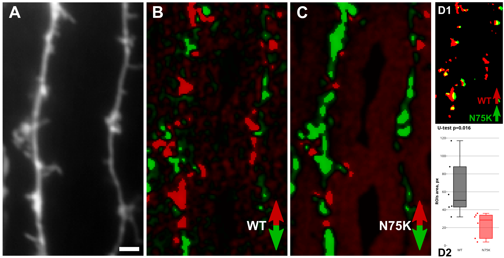

Red-Green Detection, Single Stim
================================

Based on _[Dovgan et al., 2010](https://pubmed.ncbi.nlm.nih.gov/20704590/)_, _[Osypenko et al., 2019](https://doi.org/10.1016/j.nbd.2019.104529)_

## Detecting and Comparing Translocations in Two NCSs

__A - wide-field image of EYFP channel, B - differential image for wild-type NCS channel, C - differential image for mutant NCS channel, D1 - insertions mask overlay, D2 - insertions regions area comparison__

::: domb.red_green.wt_vs_mut